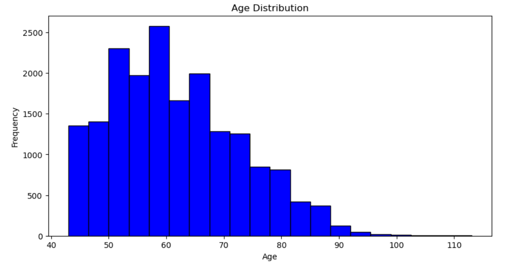
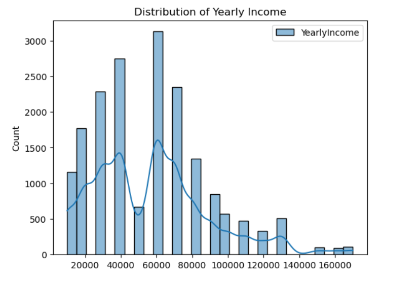
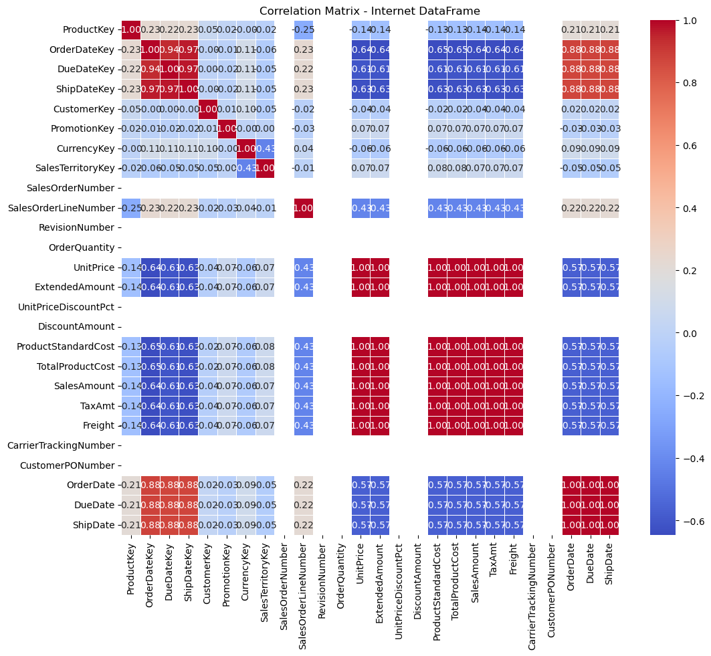
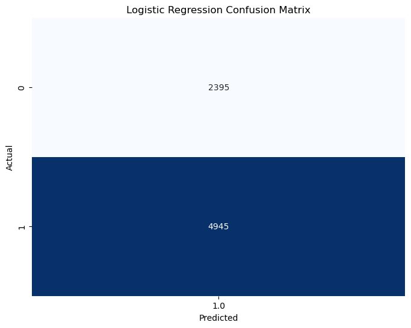

# ☁️ Cloud Data Warehousing & Big Data Processing with PySpark

A two-part big data project:

1. **Platform evaluation:** a structured comparison of **Amazon Redshift** and **Azure Synapse Analytics** for an organisation choosing a cloud data warehouse.
2. **Big data processing in PySpark:** exploration and modelling of a retail data warehouse (customers, geography, internet sales and sales quotas) with Spark DataFrames and Spark MLlib.

**Tools:** PySpark (Spark SQL, MLlib) · Python · pandas · Matplotlib · Seaborn · Amazon Redshift · Azure Synapse Analytics

---

## Part 1: Amazon Redshift vs Azure Synapse Analytics

The two platforms were compared on the four criteria that matter most when choosing a warehouse:

| Criterion | Amazon Redshift | Azure Synapse Analytics |
|---|---|---|
| **Performance at scale** | Massively parallel processing (MPP), query optimisation and result caching. Strong price-performance on RA3 nodes | Distributed MPP engine that unifies the warehouse and the data lake; built-in Spark pools for large-scale processing |
| **Elasticity** | Resize clusters or change the compute/storage ratio; Concurrency Scaling absorbs spikes | Compute and storage scale independently; serverless and dedicated pools |
| **Ease of use** | Fully managed (backups, patching); tight integration with S3, Glue and the wider AWS ecosystem; web query editor | One workspace for pipelines (Data Factory), SQL, Spark and Power BI; PolyBase for querying external data |
| **Cost efficiency** | Node-based pricing; pay for Concurrency Scaling only when used | Pay-per-query serverless option plus reserved capacity for steady workloads |

**Recommendation:** Amazon Redshift for an organisation that values mature performance tuning, security and AWS integration. Azure Synapse is the stronger fit for teams already invested in Microsoft (Power BI, Azure Data Lake) that want warehousing, data lake and Spark in one place. In practice the decision comes down to existing cloud estate, budget and integration needs.

## Part 2: Processing a retail data warehouse with PySpark

Four tables from a retail data warehouse were loaded into Spark DataFrames, cleaned, explored and modelled:

| Table | What it holds |
|---|---|
| Customers | 18,484 customers: age, income, education, occupation, marital status, home ownership |
| Geography | Cities, states/provinces and countries |
| Internet sales | Order-level transactions: quantity, unit price, discount, cost, tax, freight |
| Sales quotas | Sales targets by employee and calendar year |

### Exploratory analysis

<p float="left">
  
  
</p>

- Most customers are **45–75 years old**, with the largest group in their late 50s.
- Income clusters around **$60,000** (3,000+ customers). Average income is almost identical for men and women.
- Married customers (~10,000) outnumber single customers (~8,500).
- In internet sales, price, cost, tax and freight are almost perfectly correlated with sales amount, because they are all derived from the same order lines.



### Modelling with Spark MLlib

- **Classification:** categorical columns converted to numeric and assembled into feature vectors, then a logistic regression model trained to predict home ownership (12,502 owners vs 5,982 non-owners).
- **Regression:** linear regression to predict internet sales amount and annual sales quotas.

### What the models taught me

These first models were a useful lesson in checking results before trusting them:

- **The home-ownership classifier predicted "owner" for every customer.** Its accuracy (~67%) equals the share of owners, so it learned nothing beyond the majority class. The fix is class weighting, better features (income, children, cars owned) and judging the model on AUC and recall rather than accuracy.
- **The sales-amount regression looked near-perfect**, but only because sales amount is calculated from unit price, quantity and discount, which were inputs. That is target leakage. A real forecasting model should use only information available before the sale.
- **The sales-quota model** had only a few dozen rows, too few for a reliable regression.

<details>
<summary>Confusion matrix: home ownership classifier</summary>



</details>

---

## Repository contents

```
├── report/processing_big_data_report.pdf   # Full written report
└── images/                                 # Figures used in this README
```

*Built for the Processing Big Data module of my MSc Big Data Analytics, University of Derby, 2024.*
